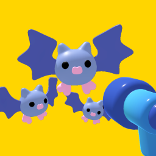

 

# Bat Swarm | Project Touchstone #
[Your First 3D GAME From Zero in Godot 4 **Survivor Arena FPS**](https://www.youtube.com/watch?v=NJJNWGD25rg&t) by [GDQuest](https://www.youtube.com/@Gdquest) ([Discord](discord.gg/CHYVgar))

This project is a beginner-friendly walkthrough for building a stylized 3D arena survival shooter in the Godot Engine, focusing on the core systems required for responsive first-person movement and fast-paced enemy combat encounters. It introduces and applies essential concepts, including node-based scene organization, physics-based character movement, mouse-controlled camera handling, enemy spawning systems, shooting mechanics, collision detection, combat feedback, score tracking, UI implementation, and game over and restart functionality. This tutorial also demonstrates important gameplay features, including implementing scalable enemy wave progression, managing enemy pursuit behavior and spawn timing, integrating audio and shader-driven visual effects for combat interactions, and structuring overall gameplay flow to create a cohesive and polished survival experience. The result is a fully playable arena shooter where players must survive increasingly difficult enemy waves while maintaining precise movement, combat awareness, and shooting accuracy to achieve higher scores and longer survival times. It also served as the foundation for completing a structured implementation task on Feather, with the project integrated into the broader development workflow supporting the Handshake AI Project Touchstone initiative.

# Assets #
[Bat Swarm Assets](https://www.gdquest.com/library/first_3d_game_godot4_arena_fps/) by [GDQuest](https://www.gdquest.com/) ([Twitter](https://x.com/NathanGDQuest))

# Create a Godot task #
<ins> What application is this task for? </ins>
 
Godot

### **Task prompt** ###
First, enter the **task prompt** and any relevant reference files (e.g., docs, diagrams, sketches, photos, schematics).

Tasks should sound like what a manager might give a skilled but junior employee: high-level guidance with some leeway on executional details, but with very clear success metrics. What a good outcome looks like must be very clear and easy to understand.

Please include any relevant **reference files** (e.g., docs, diagrams, sketches, photos, schematics) needed to complete this task.

Reminder on the difference between reference and starting state files:
- **Reference files**: anything the Employee should look at or read while completing the project that does not need to be directly loaded into the application (*'please make something that looks like XYZ image'*)
- **Starting state files (upload below)**: anything that the Employee would need to load into their workspace to complete the task (*'here is the existing file you should adapt'*)

<ins> Task prompt (ask the Employee) </ins>
 

<ins> Which of the following best fits this task? </ins>
 
Task from scratch

<ins> How long would you anticipate an 'Employee' to complete this task? (in hours) </ins>
 
5

### **Starting state** ###
Please describe and include below any information about the starting state of this project:
- Existing work to be modified
- Other assets or other inputs the Employee needs to bring to be able to complete this task

Reminder on the difference between the starting state and the reference files:
- **Starting state files**: anything that the Employee would need to load into their workspace to complete the task ('*here is the existing file you should adapt*')
- **Reference files (upload above)**: anything the Employee should look at or read while completing the project that does not need to be directly loaded into the application ('*please make something that looks like XYZ image*')

<ins> Starting state description </ins>
 
The starting state is a clean 3D project containing the foundational visual, audio, and shader resources required to develop an arena-based survival shooter experience. The included assets support the creation of a stylized combat environment focused on surviving continuous waves of hostile enemies within an open gameplay arena. These resources include a temporary level scene with a checkerboard environment texture and animated sky shader, modular enemy assets such as animated bat creature models and enemy spawn point models with custom shader effects, projectile and firearm models with associated palette textures and projectile shaders, smoke puff explosion scenes and volumetric smoke materials for combat feedback, player interface assets including a targeting reticle, background music, and multiple sound effects for weapon firing, enemy damage, enemy defeat, player death, and visual effect playback. The Employee is responsible for designing and implementing the complete gameplay experience from the ground up using the provided resources, including all required scenes, nodes, scripts, enemy spawning systems, player movement and camera controls, shooting and projectile behavior, enemy behavior and collision systems, visual and audio effect integration, scoring systems, pause and restart functionality, and all user interface elements. The Employee must create and integrate all programming, combat interactions, scene organization, animation behavior, and game flow systems necessary to transform the supplied assets into a fully playable 3D survival shooter experience.

### **Overall context** ###
Finally, include context on this task and why it is realistic and representative of real-life work:
- Why is this a reasonable task for a manager to ask a junior-level employee to do?
- Is there a larger project it might be a part of?

<ins> Task context </ins>
 
This task is a realistic and appropriate assignment for a junior-level developer, as it focuses on implementing the core systems of a 3D arena survival shooter using a provided collection of visual, audio, and shader-based resources. It involves building foundational gameplay mechanics, including first-person player movement and camera controls, projectile and shooting systems, enemy spawning and pursuit behavior, combat and damage handling, score and survival tracking, pause and restart functionality, visual effect playback, and user interface management. The work requires applying essential programming, gameplay architecture, scene organization, and debugging skills to transform a clean project structure and supporting assets into a fully interactive combat experience while organizing reusable scenes, scripts, shaders, and gameplay systems within the engine. This type of assignment reflects common real-world development practices, where junior developers are responsible for implementing gameplay mechanics, enemy behavior, combat feedback, audio integration, and interface functionality within a larger production workflow. It could serve as part of a broader 3D project to develop a complete wave-based survival shooter framework with additional enemy types, weapon variations, progression systems, environmental arenas, advanced visual effects, and expanded gameplay mechanics. By implementing these gameplay systems and combat mechanics, the task establishes a flexible foundation to expand with additional content, wave difficulty, and balancing improvements.

<ins> Rubric Items </ins>
 

 
Godot - https://feather.openai.com/tasks/d0f7c6a3-3fcf-496b-8254-8cf4e3761d87/stage/prompt_creation - Awaiting response.
